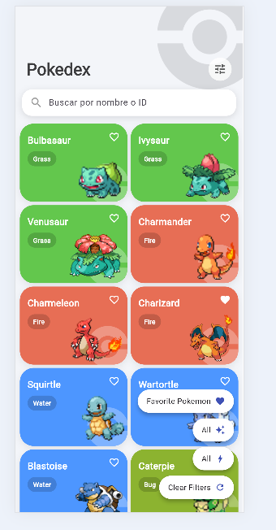
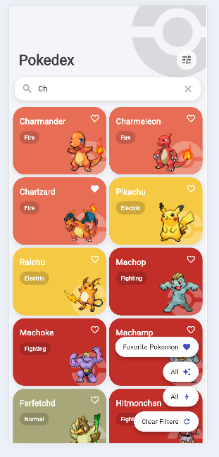
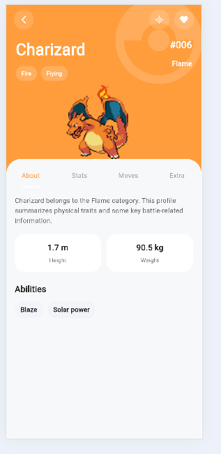
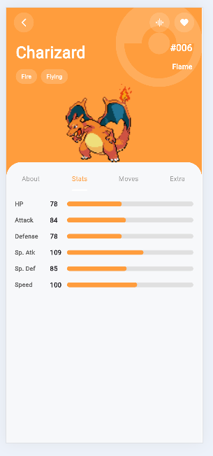
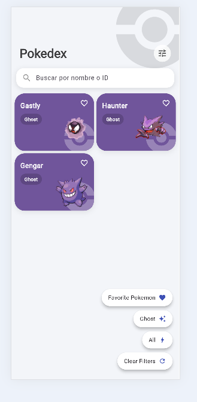
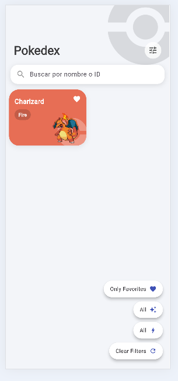
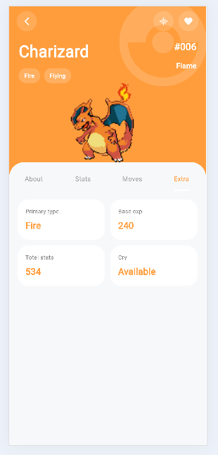
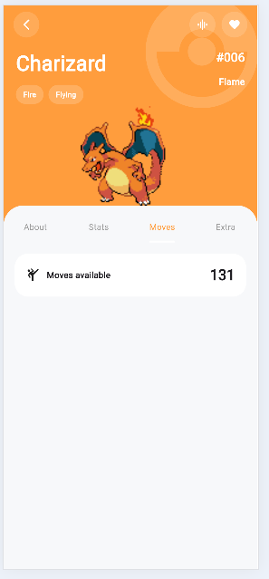

# 📱 Flutter Pokedex

A modern Pokédex mobile application built with Flutter, consuming the PokeAPI to display an interactive and visually rich Pokémon catalog.

---

## ✨ Preview

<p align="center">
  
  
  
  
</p>

## 🎥 Demo


---

## 🚀 Features

- 🔍 Search by name or ID  
- ❤️ Favorites system  
- 🎨 Dynamic colors based on Pokémon type  
- 📊 Detailed view with stats  
- 🧬 Multiple types support  
- 🔊 Sound playback (Pokémon cry)  
- 🧠 Filters:
  - By type  
  - By generation  
  - Favorites only  

---

## 🧱 Tech Stack

- **Flutter**
- **Dart**
- **GetX** (State Management)
- **REST API (PokeAPI)**
- **Cached Network Image**
- **Audioplayers**

---

## 🌐 API

Data provided by:

👉 https://pokeapi.co/

---

## 📸 Screenshots

### 🏠 Home


### 🔍 Filters


### ❤️ Favorites



### 📄 Details 





---

## ⚙️ Installation

```bash
git clone https://github.com/Samuelgs155/flutter_pokemons.git
cd flutter_pokemons
flutter pub get
flutter run